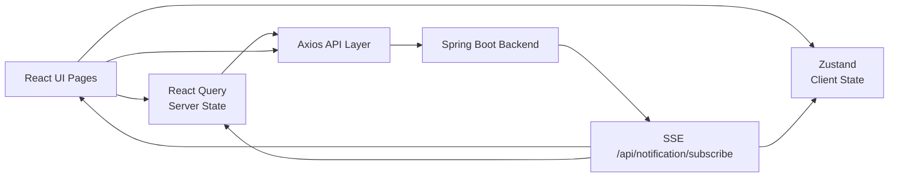

# 🌟 Memoria Frontend

> AI가 함께하는 공감 일기장 서비스 - Frontend

[](https://react.dev/)
[](https://www.typescriptlang.org/)
[](https://vite.dev/)
[](https://tanstack.com/query)
[](https://tailwindcss.com/)

## 1. 프로젝트 소개

Memoria Frontend는 사용자가 일상을 기록하고, AI와 상호작용하며, 소중한 사람들과 추억을 공유할 수 있도록 설계된 감성 중심 모바일웹 입니다.

- 개인/공유 일기장 생성, 탐색, 관리
- 리치 텍스트 기반 일기 작성과 이미지 첨부
- 감정 선택, AI 댓글/음악 생성 옵션 설정
- SSE 기반 실시간 알림
- 초대코드 기반 일기장 참여

## 2. 핵심 목표

- 모바일 사용성을 우선 고려한 작성 경험 제공
- AI 기능을 복잡한 설정 없이 자연스럽게 연결
- 실시간 알림으로 상호작용 반응성 강화
- 서버 상태와 클라이언트 상태를 분리해 확장성 확보

## 3. 기술 스택 (사용한 이유)

- React 19 + TypeScript
  - 화면/컴포넌트 규모가 커져도 타입 안정성과 유지보수성을 확보하기 위해 사용
- Vite 6
  - 빠른 개발 서버와 빌드 성능으로 반복 개발 효율을 높이기 위해 사용
- React Router
  - 로그인/비로그인 라우팅 컨텍스트를 분리해 접근 제어를 명확하게 관리하기 위해 사용
- TanStack React Query
  - 캐싱, 무효화, 재요청 등 서버 상태 관리를 표준화하기 위해 사용
- Zustand
  - 인증/알림 같은 클라이언트 전역 상태를 가볍고 단순하게 관리하기 위해 사용
- Axios (Interceptor)
  - 인증 토큰 주입과 공통 에러 처리를 네트워크 계층에서 일원화하기 위해 사용
- SSE (event-source-polyfill)
  - 실시간 알림을 안정적으로 수신하기 위해 사용
- Tailwind CSS v4 + Radix UI
  - 빠른 UI 구현과 접근성 기반 컴포넌트 활용을 위해 사용
- Tiptap
  - 일기 작성에 필요한 리치 텍스트 편집 기능을 제공하기 위해 사용
- Storybook
  - 공통 컴포넌트 단위 검증 및 협업 커뮤니케이션 강화를 위해 사용

## 4. 기여 내용

- 프론트엔드 개발 전반 담당
  - 화면 설계/구현, 상태 관리, API 연동, 사용자 흐름 개선
- AI API 연결 담당
  - AI 댓글 생성, 이미지/음악 생성 요청 API 연동
  - 로딩/실패/재시도 상태를 포함한 UX 처리
- 실시간 알림 연동
  - SSE 이벤트 수신 후 상태 스토어 반영 및 UI 즉시 업데이트
- 관리자 기능 구현
  - AI 노드 관리, 음악 큐 관리 화면 UI 및 연동

### 협업 방식

- Jira 기반 애자일 프로세스로 개발 진행
- 2주 단위 스프린트 회의로 우선순위 조정 및 백로그 갱신
- 데일리 스크럼으로 이슈 공유 및 빠른 의사결정
- 기능 단위 병렬 개발 후 리뷰/테스트를 거쳐 통합

## 5. 문제 해결

### 1) 모바일 키보드와 에디터 포커스 충돌

- 문제: 모바일 작성 중 키보드 상태 변화로 커서/포커스가 흔들리는 이슈
- 해결: visualViewport 기반 키보드 감지 + 포커스/블러 분리 관리
- 결과: 입력 중단과 커서 유실 빈도를 줄여 작성 흐름 안정화

### 2) 실시간 알림 반영 지연

- 문제: 알림 이벤트 발생 후 화면 반영까지 지연
- 해결: SSE 수신 시 Zustand 즉시 업데이트 + React Query invalidate
- 결과: 알림 목록과 뱃지 카운트 반영 속도 개선

### 3) 인증 만료 처리 분산

- 문제: 토큰 만료 처리 로직이 분산되어 예외 흐름이 불명확
- 해결: Axios interceptor에서 401 처리 공통화
- 결과: 인증 실패 시 동작 일관성 확보

## 6. 다이어그램 / 아키텍처



### Frontend 레이어 구조

```text
src/
├── api/          # API 모듈 (axios 기반)
├── components/   # 공통 UI 컴포넌트
├── features/     # 도메인별 화면/로직
├── routes/       # 인증 컨텍스트 기반 라우팅
├── services/     # SSE 등 외부 연결 서비스
├── stores/       # Zustand 전역 상태
└── models/       # 타입/모델 정의
```

## 7. 서비스 주요 화면
🏠 1. 메인 화면 (일기장 목록)
<p align="center">  </p>

사용자가 보유한 일기장을 한눈에 확인하고 관리할 수 있는 대시보드
- 일기장 조회
- 즐겨찾기 설정
- 생성 / 삭제 액션
- 초대 링크 기반 유입 지원
---
✍️ 2. 일기 작성 화면
<p align="center">  </p>

감정 기반 콘텐츠 작성 인터페이스
- 감정 선택
- 이미지 첨부
- 리치 텍스트 작성
- AI 옵션 설정
---
🤖 3. AI 응답 & 감정 분석
<p align="center">  </p> <p align="center">  </p>

작성된 일기를 기반으로 AI가 감정을 분석하고
이미지 및 음악을 생성하여 사용자 경험을 확장
- 감정 기반 AI 답장
- AI 이미지 생성
- 맞춤 음악 생성
---
📊 4. 통계 / 리포트 화면
<p align="center">  </p>

감정 흐름을 시각화한 데이터 분석 화면
- 일기장 통계
- 감정 분포
- 기간별 변화 추이
---
👥 5. 다이어리북 & 멤버 관리
- 멤버 초대 및 권한 관리
- 초대 링크 기반 참여 흐름
- 공유 다이어리 구조
---
🛠 6. 관리자 화면
- AI 노드 상태 모니터링
- 음악 큐 관리
- 서비스 운영 도구

## 역할/협업/회고

### 역할

- 프론트엔드 개발 및 AI API 연결 담당
- 작성/조회/관리/알림 등 핵심 사용자 플로우 구현

### 협업

- Jira 기반 애자일 개발
- 2주 스프린트와 데일리 스크럼으로 백로그/진행상황 관리

### 회고

- 짧은 프로젝트 기간과 제한된 예산(시간/서버/AI 비용)으로 장기 운영 검증이 어려웠음
- 디자이너 부재로 UI 완성도 고도화에 한계가 있었음
- 프론트 호스팅은 안정적이었지만 백엔드/AI 서버 클라우드 구간 장애를 경험함
- 장애 대응 과정에서 백엔드/인프라 역량 필요성을 체감했고, 학습 방향을 명확히 설정함
- 앱으로 만들고 싶었으나, 시간이 부족하여 모바일 웹으로 만들어서 아쉬움.

## 실행 방법

```bash
pnpm install
pnpm dev
```

## 빌드

```bash
pnpm build
pnpm preview
```
